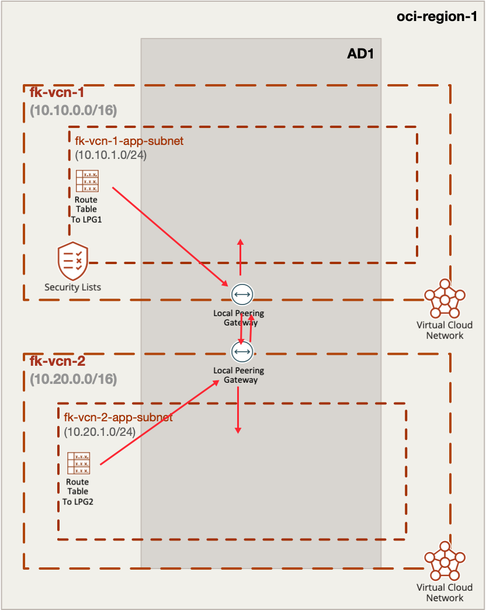
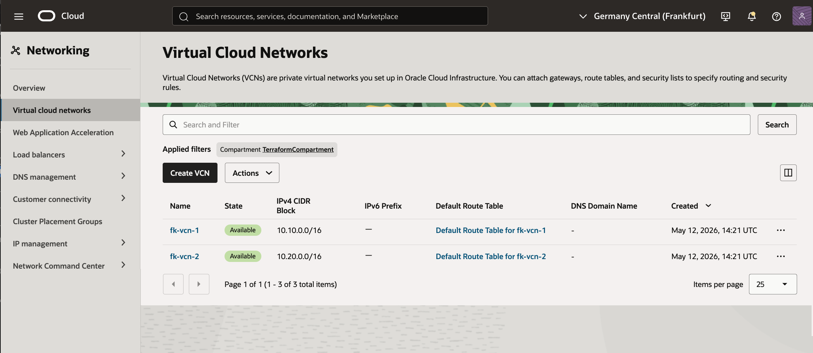
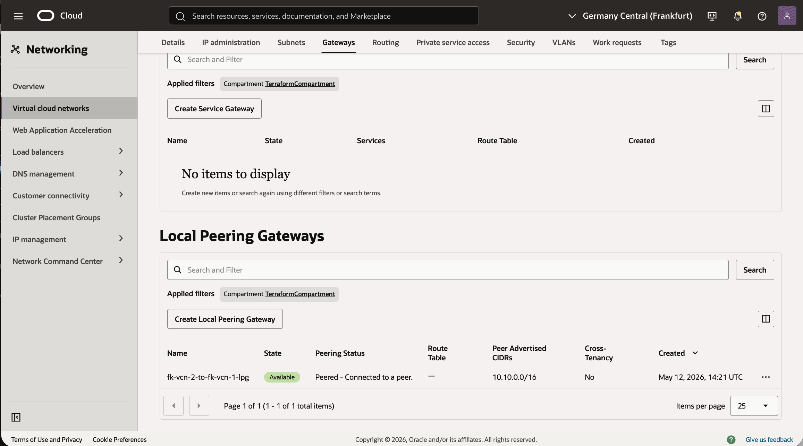
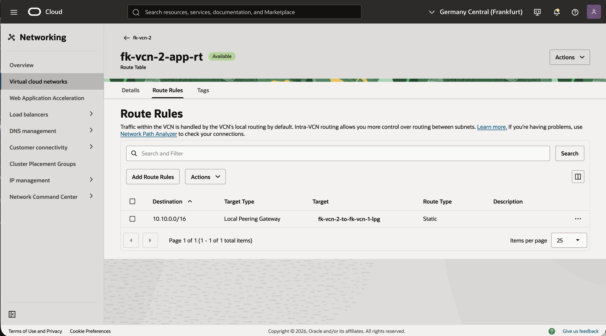

# Example 01: Basic OCI Local Peering

In this example, we deploy **two Oracle Cloud Infrastructure (OCI) Virtual Cloud Networks (VCNs)** and connect them using **Local Peering Gateways (LPGs)** with Terraform/OpenTofu.

This is a foundational same-region connectivity scenario and a natural next step after creating standalone VCNs.

---

## 🧭 Architecture Overview



This deployment creates:

- Two VCNs in the same OCI region:
  - `fk-vcn-1` (`10.10.0.0/16`)
  - `fk-vcn-2` (`10.20.0.0/16`)
- One private subnet in each VCN:
  - `fk-vcn-1-app` (`10.10.1.0/24`)
  - `fk-vcn-2-app` (`10.20.1.0/24`)
- One LPG in each VCN
- LPG peering between both VCNs
- One route table in each VCN, defined through `terraform-oci-fk-vcn`
- Subnet route table associations, also defined through `terraform-oci-fk-vcn`

Once deployed, both VCNs can exchange private traffic using their internal CIDR ranges.

---

## 🚀 Deployment Steps

Initialize and apply the Terraform/OpenTofu configuration:

```bash
cp terraform.tfvars.example terraform.tfvars
tofu init
tofu plan
tofu apply
```

After a successful deployment, Terraform will output:

- both VCN IDs
- both LPG IDs
- both subnet IDs

---

## 🖼️ OCI Console View

Below you can see the resulting VCNs, subnets, route tables, and LPG peering
as displayed in the OCI Console:



This view shows both VCNs created by the example in the same OCI region.
At this stage, verify that `fk-vcn-1` and `fk-vcn-2` both exist with the expected CIDR ranges.


This screen highlights the application subnet and route table configuration inside `fk-vcn-1`.
Confirm that subnet `fk-vcn-1-app` is attached to the route table that sends `10.20.0.0/16` traffic through the LPG.


This screen shows the matching subnet and routing setup inside `fk-vcn-2`.
Confirm that subnet `fk-vcn-2-app` uses the route table that sends `10.10.0.0/16` traffic through the second LPG.



This view focuses on the Local Peering Gateway resources attached to both VCNs.
You should see one LPG per VCN, with names and attachments matching the Terraform deployment.



This final screen confirms that the LPG connection is active and both sides are in `Peered` state.
That is the key OCI-side indicator that the local peering relationship was established successfully.

After deployment, verify the following in OCI Console:

### VCN 1
- `fk-vcn-1` with CIDR `10.10.0.0/16`
- subnet `fk-vcn-1-app` with CIDR `10.10.1.0/24`
- route table with a route to `10.20.0.0/16` through LPG1

### VCN 2
- `fk-vcn-2` with CIDR `10.20.0.0/16`
- subnet `fk-vcn-2-app` with CIDR `10.20.1.0/24`
- route table with a route to `10.10.0.0/16` through LPG2

### LPG Peering
- one LPG attached to each VCN
- both LPGs in `Peered` state

This confirms that both VCNs are connected privately within the same OCI region.

---

## 🧠 Design Notes

- LPG peering is **same-region only**
- LPG peering is **non-transitive**
- CIDR ranges must not overlap
- Route rules and security rules must be configured on both sides
- This example deliberately keeps routing inside `terraform-oci-fk-vcn`, so VCN ownership and connectivity composition stay cleanly separated

This is a practical building block for:

- same-region shared services connectivity
- OCI networking labs
- multicloud peering comparisons

---

## 🧹 Cleanup

To remove all resources created by this example:

```bash
tofu destroy
```

---

## ✅ Summary

This example demonstrates:

- how to create two OCI VCNs using reusable VCN modules
- how to connect both VCNs with LPGs
- how to model LPG routing through `terraform-oci-fk-vcn`

---

## 🌐 Learn More

Visit [FoggyKitchen.com](https://foggykitchen.com/) for OCI, multicloud, and Terraform/OpenTofu learning resources.

---

## 🪪 License

Licensed under the **Universal Permissive License (UPL), Version 1.0**.  
See [LICENSE](../../LICENSE) for more details.
